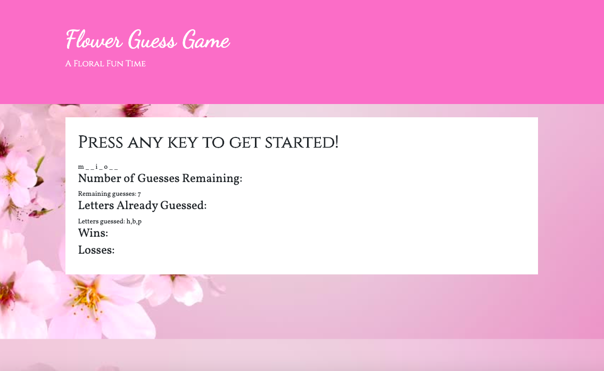

# WhatsUpWord
This is a themed word-guess application for fellow anthophiles🌺. Generate a word, and see if you can guess it before the number of guesses run out. This site will dynamically update your letter choices, # of guesses, as well as won/loss count utilizing JavaScript functionality. Do you have a green thumb? Play to find out! https://adi868.github.io/WhatsUpWord/

## Technology Used:
* HTML5
* CSS3
* JavaScript

#### Screenshot:

#### Deployed Link: 
[WhatsUpWord](https://adi868.github.io/WhatsUpWord/)

---
© 2019 Adina Cianciotto adi868
